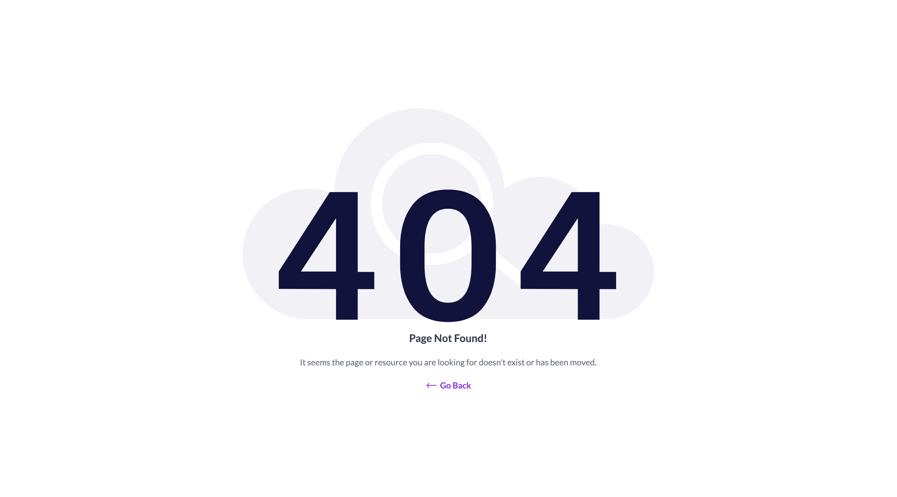

# Laravel Custom Error Views

This is a laravel package that offers you customized and beautiful error screens designed with TailwindCSS.

### Screenshots


## Installation

Begin by installing this package through Composer. Edit your project's `composer.json` file to require the package or simply run the following command:

```bash
composer require dotmarn/laravel-error-views

```

### Publishing the views

This command will publish all the necessary assets to your project's `public/` and `resources/views/` directory.

```bash
php artisan vendor:publish --tag=laravel-error-views:assets
```

### Publishing the configuration

The command below will publish the configuration file `laravel-error-views.php` to your project's `config/` directory with some defaults.

```bash
php artisan vendor:publish --tag=laravel-error-views:config
```

```php
<?php

return [

    /*
    |--------------------------------------------------------------------------
    | Default Page Title
    |--------------------------------------------------------------------------
    |
    | Here you may specify the title that will be displayed for each of the error pages
    |
    */
    'title' => [
        '403' => env('LARAVEL_ERROR_VIEWS_403_TITLE', 'Action or Page not authorized!!!'),
        '404' => env('LARAVEL_ERROR_VIEWS_404_TITLE', 'Page Not Found!'),
        '500' => env('LARAVEL_ERROR_VIEWS_500_TITLE', 'Whoops!!! Something went wrong.'),
        '503' => env('LARAVEL_ERROR_VIEWS_503_TITLE', 'Whoops!!! Service is currently unavailable')
    ],

    /*
    |--------------------------------------------------------------------------
    | Default Messages
    |--------------------------------------------------------------------------
    |
    | Here you may specify the message that will be displayed for each of the error pages
    |
    */
    'message' => [
        '403' => env('LARAVEL_ERROR_VIEWS_403_MESSAGE', 'Sorry, You do not have access to this page or resource.'),
        '404' => env('LARAVEL_ERROR_VIEWS_404_MESSAGE', 'It seems the page or resource you are looking for doesn\'t exist or has been moved.'),
        '500' => env('LARAVEL_ERROR_VIEWS_500_MESSAGE', 'Whoops!!! It\'s not you, it\'s us. Please try again.'),
        '503' => env('LARAVEL_ERROR_VIEWS_503_MESSAGE', 'Sorry, we are doing some maintenance. Please try again in few minutes.')
    ],

    /*
    |--------------------------------------------------------------------------
    | Customizing the colors for both the title, message and, back button
    |--------------------------------------------------------------------------
    |
    | Here you may specify the text colors for both the title & message
    |
    */
    'colors' => [
        'text' => [
            'title' => env('LARAVEL_ERROR_VIEWS_COLORS_TITLE', 'text-gray-700'),
            'message' => env('LARAVEL_ERROR_VIEWS_COLORS_MESSAGE', 'text-gray-500')
        ],
        'button' => [
            'text' => env('LARAVEL_ERROR_VIEWS_COLORS_BUTTON_TEXT', 'text-purple-600')
        ]
    ],

];
```

### (Optional)

If you will like to override the package's default titles and messages, you can edit the `.env` file and add the following:

```bash
LARAVEL_ERROR_VIEWS_404_TITLE="My Custom Title"
LARAVEL_ERROR_VIEWS_404_MESSAGE="My Custom Message"
```

### Contributing

Please feel free to fork this package and contribute by submitting a pull request to enhance the functionalities.

### How can I thank you?

Why not star the github repo? I'd love the attention! Why not share the link for this repository on Twitter.

Don't forget to [follow me on twitter](https://twitter.com/oluwalosheyii)!

### License

The MIT License (MIT). Please see [License File](LICENSE) for more information.