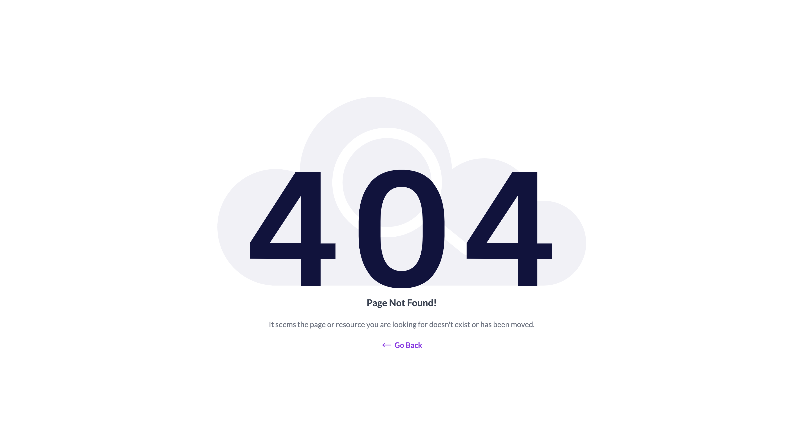

# Laravel Custom Error Views

[](https://packagist.org/packages/dotmarn/laravel-error-views) 
[](https://packagist.org/packages/dotmarn/laravel-error-views)
[](LICENSE) 
[](https://packagist.org/packages/dotmarn/laravel-error-views)
[](https://scrutinizer-ci.com/g/dotmarn/laravel-error-views/build-status/main)

This Laravel package provides self-contained, accessible error screens for HTTP 401, 403, 404, 405, 419, 429, 500, and 503 responses. It does not depend on a CDN, so the page remains readable when third-party assets are unavailable or blocked by a content-security policy.

### Screenshots


## Installation

Begin by installing this package through Composer. Edit your project's `composer.json` file to require the package or simply run the following command:

```bash
composer require dotmarn/laravel-error-views

```

### Publishing the views and assets

Publish the error views, then the local CSS and SVG artwork:

```bash
php artisan vendor:publish --tag=laravel-error-views:views
php artisan vendor:publish --tag=laravel-error-views:static-assets
```

The legacy `laravel-error-views:assets` tag still publishes both sets for existing installations.

### Publishing the configuration

The command below will publish the configuration file `laravel-error-views.php` to your project's `config/` directory with some defaults.

```bash
php artisan vendor:publish --tag=laravel-error-views:config
```

### Publishing translations

The package's English strings are translation keys by default. Publish them to customize wording or add locales:

```bash
php artisan vendor:publish --tag=laravel-error-views:lang
```

```php
<?php

return [

    /*
    |--------------------------------------------------------------------------
    | Default Page Title
    |--------------------------------------------------------------------------
    |
    | Here you may specify the title that will be displayed for each of the error pages
    |
    */
    'title' => [
        '401' => env('LARAVEL_ERROR_VIEWS_401_TITLE', 'laravel-error-views::errors.401.title'),
        // The remaining status codes follow the same pattern.
    ],

    /*
    |--------------------------------------------------------------------------
    | Default Messages
    |--------------------------------------------------------------------------
    |
    | Here you may specify the message that will be displayed for each of the error pages
    |
    */
    'message' => [
        '401' => env('LARAVEL_ERROR_VIEWS_401_MESSAGE', 'laravel-error-views::errors.401.message'),
        // The remaining status codes follow the same pattern.
    ],

    'theme' => [
        'title_color' => env('LARAVEL_ERROR_VIEWS_TITLE_COLOR'),
        'message_color' => env('LARAVEL_ERROR_VIEWS_MESSAGE_COLOR'),
        'accent_color' => env('LARAVEL_ERROR_VIEWS_ACCENT_COLOR'),
    ],

    'navigation' => [
        'show_home_link' => env('LARAVEL_ERROR_VIEWS_SHOW_HOME_LINK', true),
        'home_url' => env('LARAVEL_ERROR_VIEWS_HOME_URL', '/'),
        'show_back_link' => env('LARAVEL_ERROR_VIEWS_SHOW_BACK_LINK', true),
    ],
];
```

### Customization

Override an individual title, message, color, or navigation setting through `.env`:

```bash
LARAVEL_ERROR_VIEWS_404_TITLE="My Custom Title"
LARAVEL_ERROR_VIEWS_404_MESSAGE="My Custom Message"
LARAVEL_ERROR_VIEWS_ACCENT_COLOR="#2563EB"
LARAVEL_ERROR_VIEWS_HOME_URL="/dashboard"
```

The back link is shown only when the referring URL is on the current host and is not the current page. The Home link is always available by default.

## Development

```bash
composer test
```

The CI workflow verifies the lowest supported dependency set on PHP 8.0 and the current compatible dependency set on PHP 8.3.

## Contributing

Please feel free to fork this package and contribute by submitting a pull request to enhance the functionalities.

## How can I thank you?

Why not star the github repo? I'd love the attention! Why not share the link for this repository on Twitter.

Don't forget to [follow me on twitter](https://twitter.com/oluwalosheyii)!

## License

The MIT License (MIT). Please see [License File](LICENSE) for more information.
